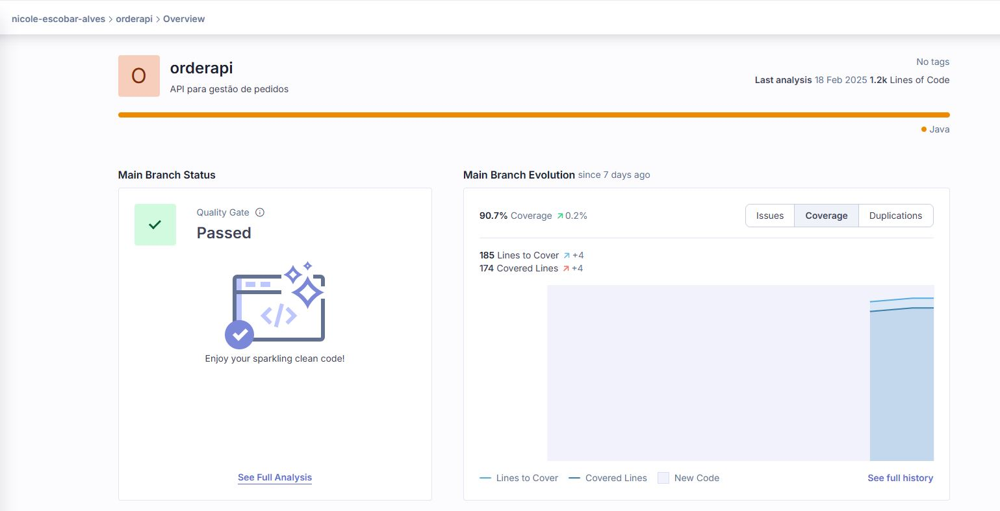

# order_api

API Rest para o microsserviço de gestão de pedidos


## 📝 Índice

- [Sobre](#about)
- [Testes](#documentation)
- [Comece por aqui](#getting_started)
- [Ferramentas](#built_using)
- [Desenvolvedores](#authors)

## 🧐 Sobre <a name = "about"></a>

O projeto foi desenvolvido na linguagem JAVA, utilizando
projeto consiste em um Cardápio Digital e um Sistema de Gerenciamento de Pedidos para uma lanchonete. Onde o cliente é capaz de realizar um pedido, escolhendo todos os produtos desejados, e realizar o pagamento. O status do pedido é gerenciado pelo estabelecimento e acompanhado pelo cliente.

### Microsserviço <a name = "about"></a>

Este microsserviço contempla a parte do gerenciamento dos pedidos.

### Testes <a name = "documentation"></a>

Este microsserviço contém testes Unitários e Testes BDD.

Validação da build da aplicação e a qualidade do cógico com Sonarqube.

[]

## 🏁 Comece por aqui <a name = "getting_started"></a>

Comandos para rodar a API na máquina local para fins de desenvolvimento e teste.

### Container
Para rodar o projeto usando o contâiner, é necessário ter o Docker instalado.

1. execute o comando: `docker-compose up` na pasta do projeto;

### Kubernets
Para rodar o projeto usando o kubernet, é necessário seguir as etapas abaixo.

1. Instalar minikube. (Consulte: [Ferramentas](#built_using))

2. No powershell, como administrador, execute o seguinte comando:
```
$ minikube start --driver=hyperv
```
3. Entrar na pasta do projeto.
4. Execute no powershell, como administrador, os seguintes comandos:

```
$ & minikube -p minikube docker-env | Invoke-Expression
$ docker build -t gestaopedidos:latest .
$ kubectl apply -f app-deployment.yaml
$ kubectl apply -f app-service.yaml
$ kubectl get pods - ambos tem que estar Running e ready 1/1
$ minikube service gestaopedidos-service --url
```
4. O powershell retorna a url da aplicação.


## ⛏️ Ferramentas <a name = "built_using"></a>

- [Postgree](https://www.postgresql.org/) - Banco de Dados.
- [Docker](https://www.docker.com/products/docker-desktop/) - Software de conteinerização.
- [Minikube](https://minikube.sigs.k8s.io/docs/) - Local Kubernets.
- [SpringBoot](https://spring.io/projects/spring-boot) - Framework.
- [Maven](https://maven.apache.org/) - Ferramenta de automação de compilação.
- [Intellij](https://www.jetbrains.com/idea/download/?section=windows) - IDE recomendada.
- [Sonarcloud](https://www.jetbrains.com/idea/download/?section=windows) - Ferramenta de análise de código.

## ✍️ Desenvolvedores <a name = "authors"></a>

- Handryo Casali
- Nicole Escobar Alves
- Luis Henrique Carreira
- Victor Hugo Silva Lima